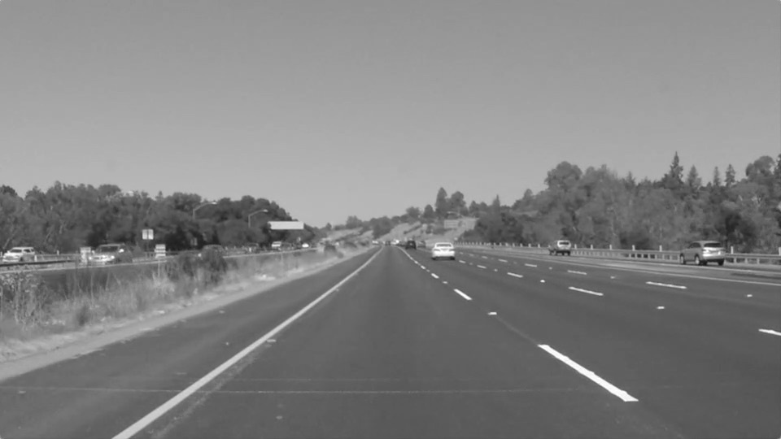
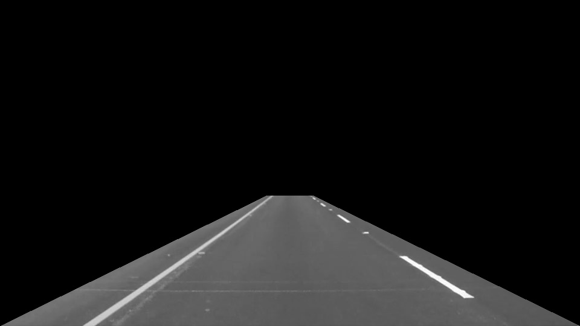
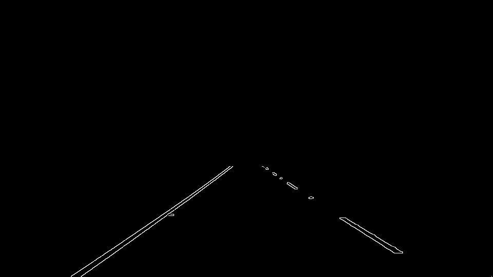
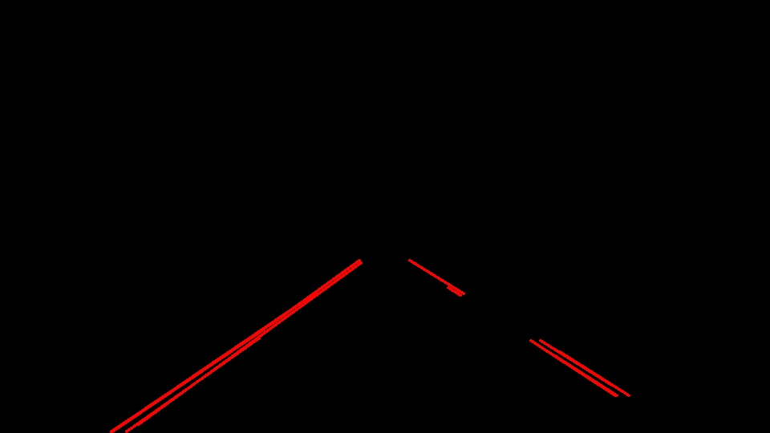
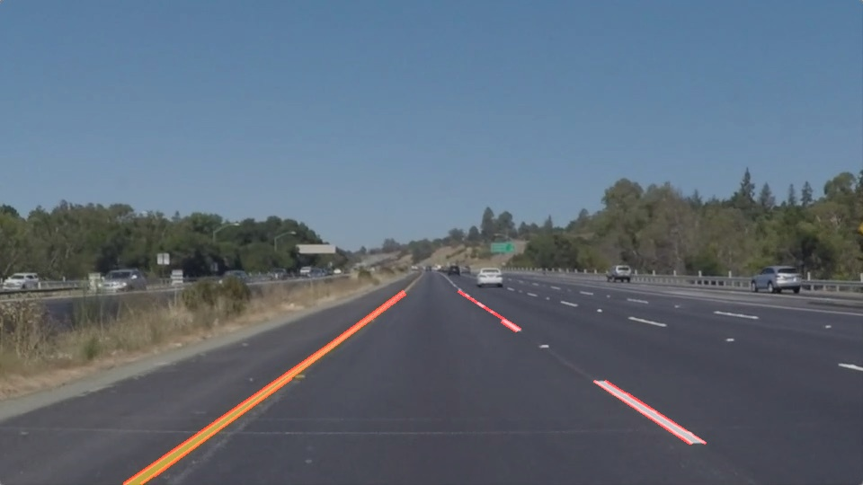
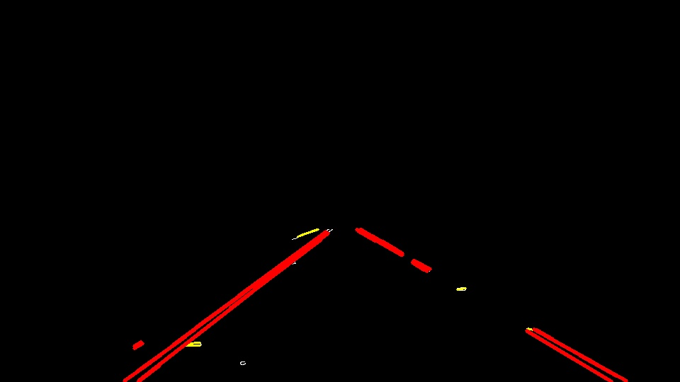

# **Finding Lane Lines on the Road** 

The goals / steps of this project are the following:
* Make a pipeline that finds lane lines on the road
* Reflect on your work in a written report

[//]: # (Image References)

[image1]: ./examples/grayscale.jpg "Grayscale"

---

### Reflection

### 1. Describe your pipeline. As part of the description, explain how you modified the draw_lines() function.

My pipeline consisted of the following steps:

1. Convert to grayscale

_Intermediate step to test the vector mask_

2. Apply Gaussian blur

3. Canny filter & vector mask

4. Hough transform

5. Combine the end image

I created two pipelines, the standard one which draws lane lines over the image and a `debug_pipeline` to help me find the best Canny, Hough and filtering parameters for the images and videos

### Modifying draw_lines()
I created two additional function `average_lines()` to average the Hough lines into two lane lines, and `filter_lines()` to filter out Hough lines which aren't lane lines (e.g. erroneous lines from shadows, reflections) based on their gradient. If the gradient of the line is too shallow or too steep, it probably isn't a lane line and it is discarded.

An example image is given below to show the filtering process. The red lines are Hough lines to keep, while the yellow lines are Hough lines to discard (based on their gradient)

I also implemented a weighted moving average filter in the `average_lines()` function specifically for the videos which helps to smooth out the jitteriness of the lane lines in the videos

### 2. Identify potential shortcomings with your current pipeline

Some shortcomings of my pipeline:
- I tried it on the challenge video, and it did not perform so well. One reason for this is because the texture of the road surface changes, and there are shadows
- The Canny and Hough parameters are far from ideal and could do with more tuning

### 3. Suggest possible improvements to your pipeline

One improvement would be to use a color filter on the image to isolate the yellow and white lines before passing it to the Canny filter.

Another one would be to fine-tune the Canny and Hough parameters (but this was boring and I didn't want to spend too much time on optimization)
